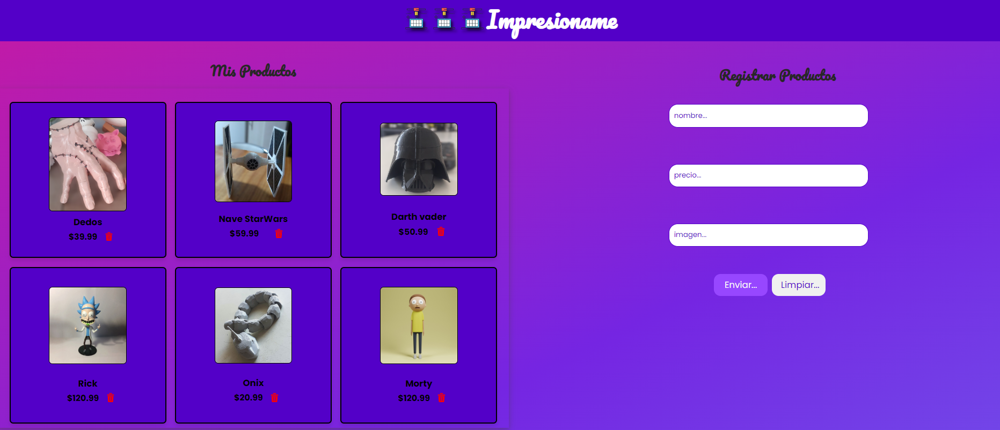

# AluraGeek 🚀

Bienvenido a AluraGeek, una página web diseñada para mostrar productos, cargar nuevos productos y eliminar productos de una lista.

## Uso

No se requiere ninguna configuración especial para utilizar AluraGeek. Simplemente ingresa desde tu navegador web favorito y utiliza el formulario para cargar nuevos productos. Proporciona el nombre, el precio y la imagen del producto correspondiente, luego presiona el botón "Enviar". El producto se agregará automáticamente a la sección "Mis Productos". Para eliminar un producto de la lista, simplemente haz clic en el botón "Eliminar" que se encuentra en la parte inferior de cada producto.

## Contribución

AluraGeek es un proyecto de código abierto, lo que significa que cualquier desarrollador puede contribuir al mismo. ¡Estamos abiertos a contribuciones en todas las áreas, desde el diseño hasta la robustez del código! Por favor, asegúrate de seguir buenas prácticas de codificación y contribuir de manera constructiva para mejorar la aplicación.

## Capturas de Pantalla

¡Diviértete explorando y contribuyendo a Impresioname! 😄✨
